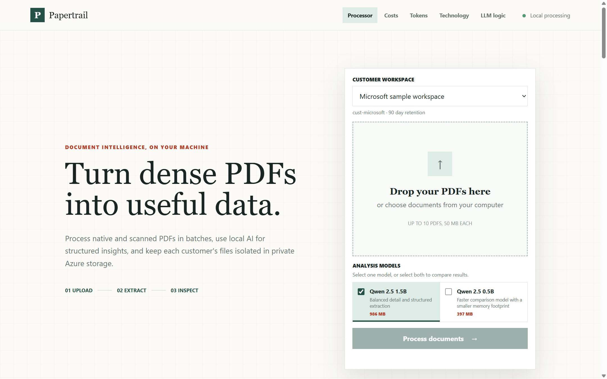
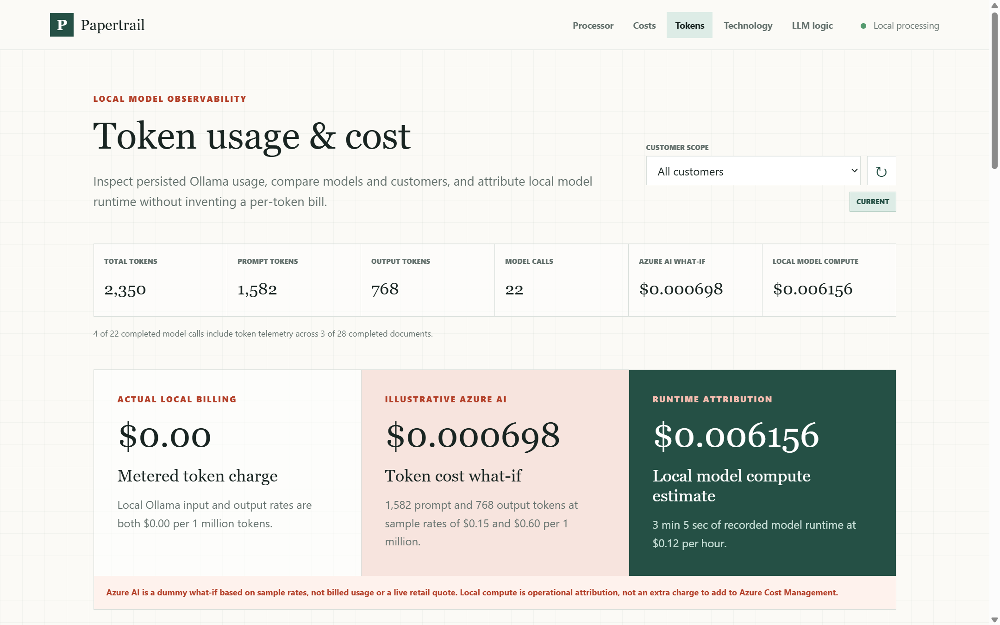
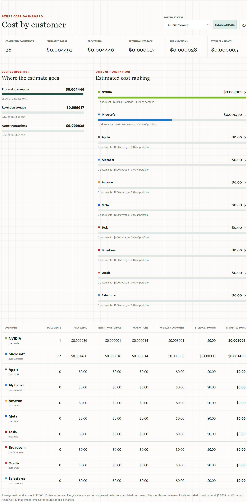

## Overview

Papertrail turns native or scanned PDF documents into structured JSON. It uses
PyMuPDF for layout-aware native text extraction and Tesseract OCR when a page
does not contain enough usable text. It classifies each result as an invoice,
receipt, contract, report, resume, letter, form, or other document. A local
Selectable Qwen2.5 models summarize extracted content and identify key points,
entities, and action items. Selecting both models produces side-by-side output,
runtime, token, and confidence comparisons. SQLite retains run history, key
metadata, and complete results. Documents and prompts remain inside Docker.

## Application previews

### Process documents



### Review token usage and cost



<details>
<summary>View the complete customer cost dashboard</summary>



</details>

## Run as a Docker project

Docker Desktop must be running. Create the local environment file, download and
verify the OCR models, then build and host the project:

```powershell
Copy-Item .env.example .env
./scripts/Get-OcrModels.ps1
docker compose up --detach --build --wait
```

The first start downloads the Qwen2.5 1.5B and 0.5B models into a named Docker volume.
Open <http://localhost:8081>, select up to 10 PDFs, wait for processing, inspect
each document and its AI analysis, then download the JSON results. The upload
screen lists recent runs and can reopen completed results or resume active work.

Open <http://localhost:8081/technology> for the processing architecture,
extraction decisions, component inventory, and runtime boundaries.
Open <http://localhost:8081/logic> for the exact local LLM input boundary,
prompt sequence, output contract, normalization, and failure behavior.
Open <http://localhost:8081/tokens> for persisted token usage, local model
compute attribution, and the illustrative Azure AI cost comparison.

The primary [compose.yaml](compose.yaml) file builds versioned images and runs
the `papertrail` project. Use the image-only manifest after the images have
been built locally or loaded from a registry:

```powershell
docker compose -f compose.deploy.yaml up --detach --wait
```

Both modes use the same named volumes, so switching modes preserves uploaded
PDFs, generated JSON, SQLite history, and Redis state. Edit `.env` to change
the public port, image tags, processing limits, OCR settings, or resource names.

For a new Docker host, private GitHub Container Registry images, production
secrets, upgrades, rollback, backups, and health checks, follow the
[deployment guide](DEPLOYMENT.md).

Inspect the hosted project in Docker Desktop or from the command line:

```powershell
docker compose ps
docker compose logs --follow api worker
```

Stop the services without deleting document data:

```powershell
docker compose down
```

Delete services and all persisted documents and job data:

```powershell
docker compose down --volumes
```

## Architecture

| Service        | Purpose                                                |
|----------------|--------------------------------------------------------|
| `web`          | Nginx Web UI and API proxy on host port 8081           |
| `api`          | FastAPI batch upload, status, result, and download API |
| `worker`       | Celery extraction, OCR, classification, and AI worker  |
| `redis`        | Internal queue and job-result backend                  |
| `ollama`       | Internal local-model inference API                     |
| `ollama-model` | One-shot model installation service                    |

The worker selects native text when a page meets the configured character
threshold. Otherwise it renders the page at 300 DPI and runs OCR. Every result
records page dimensions, text source, block coordinates, confidence, metadata,
classification category, local AI analysis, evidence confidence, checksum,
timing, and warnings. Evidence confidence combines extraction quality (70%) and
prompt context coverage (30%); it does not claim that generated text is true.

## Persistent history

Papertrail uses Python's embedded SQLite 3 library, so history requires no
additional database service or network port. The database is stored at
`/data/papertrail.db` in the `papertrail_document-data` named volume. API and
worker containers share that volume and use SQLite WAL mode with a busy timeout
for short concurrent status and result writes.

Each run stores its job and document IDs, batch, filename, latest status, stage,
progress, classification, page and source details, AI state, checksums,
timestamps, warnings, and the complete result JSON. Existing result files are
imported once when the API starts. Removing containers does not remove history;
`docker compose down --volumes` deletes it intentionally with other local data.

Stop database writers before creating a consistent volume backup:

```powershell
docker compose stop api worker
docker run --rm --volume papertrail_document-data:/data:ro --volume "${PWD}:/backup" alpine:3.21 tar -czf /backup/papertrail-document-data.tgz -C /data .
docker compose start api worker
```

Restore the archive into an empty named volume, then point Compose to it:

```powershell
docker compose down
docker volume create papertrail_document-data-restored
docker run --rm --volume papertrail_document-data-restored:/data --volume "${PWD}:/backup:ro" alpine:3.21 tar -xzf /backup/papertrail-document-data.tgz -C /data
$env:PAPERTRAIL_DOCUMENT_VOLUME = "papertrail_document-data-restored"
docker compose up --detach --wait
```

## Open-source models

The `models` directory contains official Tesseract `tessdata_best` files:

| Model             | Purpose                       | Size    | License    |
|-------------------|-------------------------------|---------|------------|
| `eng.traineddata` | English text recognition      | 15.4 MB | Apache-2.0 |
| `osd.traineddata` | Orientation and script detect | 10.6 MB | Apache-2.0 |
| `qwen2.5:1.5b`    | Structured document analysis  | 986 MB  | Apache-2.0 |
| `qwen2.5:0.5b`    | Fast comparison analysis      | 397 MB  | Apache-2.0 |

The verified downloader uses the official
[tessdata_best repository](https://github.com/tesseract-ocr/tessdata_best).
These models run locally on CPU and do not require a cloud account or GPU.
Ollama downloads both Qwen models only through the one-shot bootstrap network. The running
inference service has no published port and remains on the internal network.

## Validate the solution

Run unit tests inside the same image used by the service:

```powershell
docker compose --profile test run --rm test
```

Check service state and logs:

```powershell
docker compose ps
docker compose logs api worker ollama
```

## Configuration

Environment variables can be added under the `api` and `worker` services in
`compose.yaml`.

| Variable                    | Default                         | Purpose                           |
|-----------------------------|---------------------------------|-----------------------------------|
| `MAX_FILE_SIZE_MB`          | `50`                            | Maximum upload size               |
| `MAX_PDF_PAGES`             | `500`                           | Maximum page count                |
| `NATIVE_TEXT_MIN_CHARS`     | `30`                            | Native-text threshold before OCR  |
| `OCR_LANGUAGES`             | `eng`                           | Tesseract language combination    |
| `OCR_DPI`                   | `300`                           | OCR page rendering resolution     |
| `JOB_TIMEOUT_SECONDS`       | `600`                           | Processing task deadline          |
| `MAX_BATCH_DOCUMENTS`       | `10`                            | Maximum PDFs in one batch         |
| `AI_ENABLED`                | `true`                          | Enable local document analysis    |
| `OLLAMA_MODEL`              | `qwen2.5:1.5b`                  | Default local model               |
| `OLLAMA_AVAILABLE_MODELS`   | `qwen2.5:1.5b,qwen2.5:0.5b`    | Selectable models                 |
| `MAX_ANALYSIS_MODELS`       | `2`                             | Models allowed per document       |
| `AI_TIMEOUT_SECONDS`        | `180`                           | Model request deadline            |
| `AI_MAX_CHARACTERS`         | `12000`                         | Maximum extracted text sent to AI |
| `AZURE_AI_SAMPLE_INPUT_1M_TOKENS_USD` | `0.15`              | Illustrative Azure input rate      |
| `AZURE_AI_SAMPLE_OUTPUT_1M_TOKENS_USD` | `0.60`             | Illustrative Azure output rate     |

See [SPECIFICATION.md](SPECIFICATION.md) for the product requirements, JSON
contract, security constraints, and acceptance criteria.