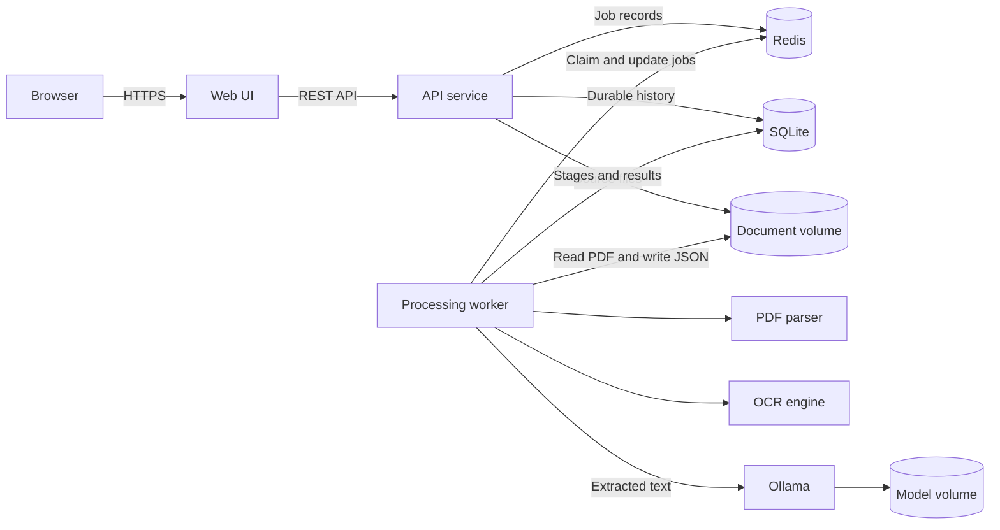

## Summary

The platform accepts PDF files through a browser, processes each document in an
isolated Docker environment, and produces a structured JSON representation of
its content. Users can monitor processing, inspect extracted text and metadata,
and download the JSON result.

The minimum viable product (MVP) runs locally or on a single server with Docker
Compose. Its architecture must permit later replacement of local storage and
the job queue with managed services without changing the public API.

## Goals

* Upload text-based or scanned PDF documents from a Web UI
* Process documents asynchronously without blocking HTTP requests
* Extract metadata, page text, headings, paragraphs, tables, and images where
  the source document permits reliable detection
* Apply optical character recognition (OCR) to pages without usable text
* Produce deterministic, versioned JSON with page-level provenance
* Show job progress, errors, extracted content, and downloadable results
* Package all runtime components as Docker containers
* Protect the host and users from malformed or hostile documents

## Non-goals for the MVP

* Editing PDFs or extracted content
* Handwriting recognition
* Semantic question answering or document chat
* Pixel-perfect reconstruction of the PDF layout
* Training custom OCR or machine-learning models
* Multi-tenant billing, enterprise identity, or retention policies
* Processing encrypted PDFs unless the user supplies a password in a future
  release

## Users and primary workflow

The primary user is an analyst or developer who needs machine-readable content
from one or more PDF documents.

1. The user opens the Web UI and selects or drops a PDF.
2. The UI validates the file type and configured size limit.
3. The API stores the source file, creates a job, and returns a job identifier.
4. A worker claims the job and extracts native PDF text and layout data.
5. The worker applies OCR only to pages with insufficient native text.
6. The worker normalizes the extracted content into the JSON contract.
7. The UI displays progress while polling the job endpoint.
8. The user reviews page content and downloads the JSON result.
9. The system deletes expired source and result files according to retention
   settings.

## Functional requirements

### Document upload

* Accept files with the `application/pdf` media type and a valid PDF signature
* Support drag-and-drop and file-picker input
* Allow one upload at a time in the MVP
* Default to a 50 MB maximum file size and 500-page maximum, configurable by
  environment variables
* Calculate and store a SHA-256 checksum for each source file
* Reject malformed, encrypted, oversized, or page-limit-exceeding documents
  with a clear error code
* Return `202 Accepted` after safely storing the file and queuing the job

### Processing

* Inspect every page for native text before invoking OCR
* Extract native text with coordinates and reading order when available
* Run OCR at a configurable resolution, defaulting to 300 DPI, for pages whose
  extracted text is below a configurable quality threshold
* Default OCR language to English and allow additional installed language packs
  through configuration
* Normalize Unicode, whitespace, line endings, and page numbering
* Preserve page boundaries and bounding boxes for traceability
* Detect headings and paragraphs using font, position, spacing, and reading-order
  signals
* Extract tables into rows and cells when detection confidence meets the
  configured threshold
* Record embedded image metadata; image extraction is optional for the MVP
* Report warnings for partial extraction without failing the entire document
* Make repeated processing of the same file and configuration deterministic
* Stop processing after the configurable timeout, defaulting to 10 minutes

### Job management

Jobs use these states:

```text
queued -> processing -> completed
                     -> completed_with_warnings
       -> failed
       -> cancelled
```

* Persist job state independently of the API process
* Expose stage and percentage progress where measurable
* Record creation, start, completion, and expiry timestamps in UTC
* Preserve a machine-readable failure code and a user-safe error message
* Permit cancellation of queued jobs; processing-job cancellation is optional
  for the MVP
* Prevent two workers from processing the same job concurrently

### Results

* Render document metadata and processing warnings
* Provide page navigation and full-document text search in the browser
* Show extracted blocks in reading order, grouped by page
* Render detected tables as accessible HTML tables
* Allow the complete JSON result to be downloaded
* Never render extracted PDF content as trusted HTML

## System architecture



### Components

| Component         | Responsibility                                     | Implementation             |
|-------------------|----------------------------------------------------|----------------------------|
| Web UI            | Batch upload, status, result viewer, JSON download | HTML, CSS, and JavaScript  |
| API service       | Validation, job lifecycle, result delivery        | FastAPI with Python        |
| Processing worker | Extraction, OCR, classification, and analysis     | Celery worker with Python  |
| Job store         | Queue, progress, status, and short-lived job data  | Redis                      |
| History store     | Durable runs, last state, metadata, and results    | SQLite 3 on document volume |
| Document storage  | Source PDFs and generated JSON                    | Named Docker volume        |
| PDF parser        | Text, coordinates, metadata, and page rendering   | PyMuPDF                    |
| OCR engine        | Text recognition for scanned pages               | Tesseract                  |
| Local AI          | Selectable grounded analysis and comparison        | Ollama with local models   |

Library choices are implementation details, not public API contracts.

## Processing pipeline

1. Validate the upload stream, PDF signature, size, and page count.
2. Store the source under an opaque generated identifier, never its original
   filename.
3. Store the queued run in SQLite, then publish its identifier to Redis.
4. Open the PDF in the worker with network access disabled.
5. Extract document metadata and per-page native text blocks.
6. Calculate page text quality using character count, printable-character
   ratio, and replacement-character ratio.
7. Render and OCR pages that do not meet the native-text threshold.
8. Detect structural blocks and tables, preserving coordinates and confidence.
9. Classify the document from its filename, metadata, and extracted text.
10. Send identical bounded extracted text to each selected Ollama model for
  grounded summary, key point, entity, and action-item generation.
11. Normalize content into schema version `1.2`.
12. Validate the result against the JSON Schema before storage.
13. Write the JSON atomically and persist its complete contents plus terminal
  run state in SQLite.

When native and OCR text both exist for a page, the worker selects one source
for each block. It must not concatenate duplicate text. The selected source and
confidence remain visible in the output.

Classification uses transparent weighted phrase rules. Supported categories
are `invoice`, `receipt`, `contract`, `report`, `resume`, `letter`, `form`, and
`other`. The `other` category is used when no classification signal matches.

## JSON output contract

All coordinates use PDF points in a top-left coordinate system and follow the
order `[x0, y0, x1, y1]`. Page numbers are one-based. Identifiers are opaque
UUIDs. Timestamps use ISO 8601 UTC format.

### Example result

```json
{
  "schema_version": "1.2",
  "document": {
    "id": "79c16464-65ba-47dc-a775-ddd303c52ef5",
    "filename": "quarterly-report.pdf",
    "media_type": "application/pdf",
    "sha256": "3af0...7be2",
    "size_bytes": 482102,
    "page_count": 1,
    "classification": {
      "category": "report",
      "method": "keyword_rules",
      "matched_terms": ["report", "quarterly"]
    },
    "metadata": {
      "title": "Quarterly Report",
      "author": "Example Company",
      "created_at": "2026-09-20T12:00:00Z"
    }
  },
  "processing": {
    "job_id": "18227367-66dc-4038-bdbf-19ca7c148345",
    "status": "completed",
    "started_at": "2026-09-29T10:15:00Z",
    "completed_at": "2026-09-29T10:15:08Z",
    "duration_ms": 8124,
    "ocr_languages": ["eng"],
    "warnings": []
  },
  "analysis": {
    "status": "completed",
    "provider": "ollama",
    "model": "qwen2.5:1.5b",
    "confidence": {
      "score": 99,
      "level": "high",
      "method": "input_quality_v1",
      "extraction_quality": 98,
      "context_coverage": 100,
      "characters_analyzed": 51,
      "characters_available": 51
    },
    "summary": "Quarterly revenue increased by 12%.",
    "key_points": ["Revenue increased by 12%"],
    "entities": [],
    "action_items": []
  },
  "analyses": [
    {
      "status": "completed",
      "provider": "ollama",
      "model": "qwen2.5:1.5b",
      "summary": "Quarterly revenue increased by 12%.",
      "key_points": ["Revenue increased by 12%"],
      "entities": [],
      "action_items": []
    },
    {
      "status": "completed",
      "provider": "ollama",
      "model": "qwen2.5:0.5b",
      "summary": "Revenue rose 12% during the quarter.",
      "key_points": ["Quarterly revenue rose 12%"],
      "entities": [],
      "action_items": []
    }
  ],
  "pages": [
    {
      "page_number": 1,
      "width": 612,
      "height": 792,
      "rotation": 0,
      "text_source": "native",
      "text": "Quarterly Report\nRevenue increased by 12%.",
      "blocks": [
        {
          "id": "p1-b1",
          "type": "heading",
          "text": "Quarterly Report",
          "bbox": [72, 68, 310, 96],
          "confidence": 0.99,
          "source": "native"
        },
        {
          "id": "p1-b2",
          "type": "paragraph",
          "text": "Revenue increased by 12%.",
          "bbox": [72, 112, 330, 132],
          "confidence": 0.98,
          "source": "native"
        }
      ],
      "tables": [],
      "images": []
    }
  ]
}
```

### Required fields

| Path                                  | Type    | Description                                      |
|---------------------------------------|---------|--------------------------------------------------|
| `schema_version`                      | string  | Output contract version                          |
| `document.id`                         | string  | Internal document UUID                           |
| `document.filename`                   | string  | Sanitized original display name                  |
| `document.media_type`                 | string  | Always `application/pdf` in the MVP              |
| `document.sha256`                     | string  | Lowercase SHA-256 digest                         |
| `document.size_bytes`                 | integer | Uploaded file size                               |
| `document.page_count`                 | integer | Total page count                                 |
| `document.classification.category`    | string  | Detected document category                       |
| `document.classification.method`      | string  | Classification implementation identifier         |
| `document.classification.matched_terms` | array | Text signals used for the selected category       |
| `processing.job_id`                   | string  | Processing job UUID                              |
| `processing.status`                   | string  | Terminal job status                              |
| `processing.warnings`                 | array   | Non-fatal processing issues                      |
| `analysis.status`                     | string  | Local AI completion state                        |
| `analysis.provider`                   | string  | Local model runtime                              |
| `analysis.model`                      | string  | Model identifier                                 |
| `analysis.confidence.score`           | integer | Evidence-quality score from 0 through 100        |
| `analysis.confidence.level`           | string  | `high`, `medium`, or `low` score band            |
| `analysis.confidence.method`          | string  | Versioned deterministic scoring method           |
| `analysis.confidence.extraction_quality` | integer | Text-length-weighted extraction quality       |
| `analysis.confidence.context_coverage` | integer | Percentage of available text sent to the model  |
| `analysis.confidence.characters_analyzed` | integer | Prompt evidence character count              |
| `analysis.confidence.characters_available` | integer | Available page-marked character count        |
| `analysis.summary`                    | string  | Grounded document summary                        |
| `analysis.key_points`                 | array   | Up to five grounded key points                   |
| `analysis.entities`                   | array   | Up to ten named entities                         |
| `analysis.action_items`               | array   | Up to five explicit actions                      |
| `analyses`                            | array   | All selected model results in request order      |
| `pages`                               | array   | Pages in source order                            |
| `pages[].page_number`                 | integer | One-based source page number                     |
| `pages[].text_source`                 | string  | `native`, `ocr`, `mixed`, or `none`              |
| `pages[].text`                        | string  | Plain text in reading order                      |
| `pages[].blocks`                      | array   | Structural content blocks                        |
| `pages[].blocks[].type`               | string  | `heading`, `paragraph`, `list`, `caption`, other |
| `pages[].blocks[].bbox`               | array   | Four numeric page coordinates                    |
| `pages[].blocks[].confidence`         | number  | Value from 0 through 1                           |
| `pages[].blocks[].source`             | string  | `native` or `ocr`                                |

Table objects contain a bounding box, confidence, and ordered `rows`. Each row
contains ordered `cells`; each cell contains text, row and column indexes, spans,
and an optional bounding box. Image objects contain an identifier, bounding box,
dimensions, format, and optional object-storage reference.

Backward-compatible additions may occur within schema version `1.x`. Removing
or changing field meaning requires a new major schema version.

## REST API

All responses use JSON except file upload and result download. Error responses
use a consistent object with `code`, `message`, and `request_id` fields.

| Method   | Path                            | Purpose                                | Success |
|----------|---------------------------------|----------------------------------------|---------|
| `POST`   | `/api/v1/documents`             | Upload a PDF and create a job          | `202`   |
| `POST`   | `/api/v1/documents/batch`       | Upload up to 10 PDFs and create jobs   | `202`   |
| `GET`    | `/api/v1/models`                | List selectable local analysis models  | `200`   |
| `GET`    | `/api/v1/jobs/{job_id}`         | Read status, stage, progress, warnings | `200`   |
| `DELETE` | `/api/v1/jobs/{job_id}`         | Cancel a queued job                    | `202`   |
| `GET`    | `/api/v1/history`               | List durable run history               | `200`   |
| `GET`    | `/api/v1/documents/{id}/result` | Read the structured JSON result        | `200`   |
| `GET`    | `/api/v1/documents/{id}/download` | Download the JSON result             | `200`   |
| `GET`    | `/api/v1/health/live`           | Report process liveness                | `200`   |

The single upload request uses `multipart/form-data` with a required `file`
field. The batch request uses repeated `files` fields. Both accept repeated
`models` fields and return the selected models with each queued job.

## Web UI specification

### Upload view

* Display a prominent multi-file drop zone with a file-picker alternative
* State accepted PDF type and configured size limit near the control
* Show every filename, size, and remove action before submission
* Offer one or two locally installed models with the default preselected
* List recent durable runs with last state, classification, AI state, and time
* Reopen completed history or resume tracking queued and processing runs
* Disable submission while validation fails or upload is active
* Show upload progress separately from processing progress
* Support keyboard operation and visible focus states

### Processing view

* Display per-document and aggregate stages, including local AI analysis
* Show determinate progress when known and an indeterminate state otherwise
* Preserve job state across page refreshes by encoding the job identifier in the
  route
* Offer cancellation while the job is queued
* Present user-safe recovery guidance after a failure

### Result view

* Use a two-panel desktop layout with page navigation on the left and extracted
  content on the right
* Collapse to a single-column layout on narrow screens
* Include tabs for content, local AI analysis, plain text, metadata, and warnings
* Compare selected model runtime, output tokens, evidence confidence, summaries,
  key points, entities, and action items side by side
* Provide document-level search with page and block result links
* Show each block's source and confidence on demand, not as visual clutter
* Provide a persistent JSON download action
* Preserve whitespace in plain-text mode while allowing long text to wrap

### LLM logic view

* Show which extracted fields enter the prompt and which PDF data stays out
* Explain page ordering, context truncation, grounding instructions, and model
  request settings
* Display the structured output contract and application-level item limits
* Distinguish completed, skipped, failed, and disabled analysis outcomes
* Explain the 70% extraction-quality and 30% context-coverage confidence score
* State that generated insights require review against the extracted source text

### Accessibility

* Meet Web Content Accessibility Guidelines (WCAG) 2.2 Level AA
* Use native controls and semantic landmarks
* Announce upload, progress, completion, and failure changes through an ARIA live
  region
* Maintain a logical focus order and return focus after dialogs close
* Do not rely on color alone to communicate status
* Respect reduced-motion preferences

## Docker specification

Docker Compose defines these services:

| Service        | Published port  | Persistent data | Runtime constraints             |
|----------------|-----------------|-----------------|---------------------------------|
| `web`          | `8081`          | None            | Public project entry point      |
| `api`          | None            | Document volume | Non-root user                   |
| `worker`       | None            | Document volume | Non-root user, internal network |
| `redis`        | None            | Named volume    | Internal network only           |
| `ollama`       | None            | Model volume    | Internal inference only         |
| `ollama-model` | None            | Model volume    | One-shot model bootstrap        |

* Use multi-stage builds and pinned base-image versions
* Include health checks for `web`, `api`, Redis, and Ollama
* Run application containers as non-root users
* Mount only dedicated data and temporary directories
* Set CPU and memory limits for workers in production deployment manifests
* Keep secrets in environment variables or Docker secrets, never in images or
  committed Compose values
* Keep API, Redis, worker, and Ollama ports inaccessible from the host
* Store `/data/papertrail.db`, source PDFs, and generated JSON in the stable
  document volume
* Separate build-time dependencies from runtime images
* Emit container logs to standard output and standard error

### Configuration

| Variable                    | Default        | Purpose                              |
|-----------------------------|----------------|--------------------------------------|
| `MAX_FILE_SIZE_MB`          | `50`           | Maximum upload size                  |
| `MAX_PDF_PAGES`             | `500`          | Maximum document page count          |
| `JOB_TIMEOUT_SECONDS`       | `600`          | Worker processing deadline           |
| `RETENTION_HOURS`           | `24`           | Source and result retention          |
| `OCR_LANGUAGES`             | `eng`          | Installed and allowed OCR languages  |
| `OCR_DPI`                   | `300`          | Page rendering resolution            |
| `NATIVE_TEXT_MIN_CHARS`     | `30`           | OCR fallback threshold               |
| `MAX_BATCH_DOCUMENTS`       | `10`           | Maximum documents per upload batch   |
| `AI_ENABLED`                | `true`         | Enable local analysis                |
| `OLLAMA_MODEL`              | `qwen2.5:1.5b` | Local Ollama model                    |
| `OLLAMA_AVAILABLE_MODELS`   | Five model IDs | Comma-separated selectable models     |
| `MAX_ANALYSIS_MODELS`       | `2`            | Models allowed per processing run     |
| `AI_TIMEOUT_SECONDS`        | `180`          | Local model request deadline          |
| `AI_MAX_CHARACTERS`         | `12000`        | Maximum document text sent to AI      |
| `REDIS_URL`                 | Required       | Queue and job store connection       |
| `DATA_DIR`                  | `/data`        | Mounted source and result directory  |
| `OLLAMA_BASE_URL`           | Internal URL   | Ollama inference endpoint            |
| `ALLOWED_ORIGINS`           | Same origin    | Permitted browser origins            |

## Security and privacy

* Treat every PDF and every extracted string as untrusted input
* Validate file signatures instead of trusting extensions or media types
* Use parser and OCR library versions with active security support
* Disable JavaScript, embedded-file execution, external references, and network
  access during processing
* Enforce decompression, image-dimension, page-count, memory, CPU, and time limits
* Escape extracted content before rendering and apply a restrictive Content
  Security Policy
* Generate opaque storage keys and prevent path traversal
* Avoid recording document content, filenames, credentials, or signed URLs in
  logs
* Delete temporary worker files after success, failure, or cancellation
* Delete stored inputs and results after the configured retention period
* Require TLS and authentication for any deployment beyond trusted local use
* Scan uploaded files with an antivirus service when deployed in a shared or
  internet-facing environment
* Produce a software bill of materials and scan images in continuous integration

## Reliability and observability

* Use structured JSON logs with timestamp, level, service, request ID, job ID,
  stage, duration, and error code
* Expose metrics for request count, upload bytes, queue depth, processing time,
  OCR page count, job outcome, and worker resource use
* Propagate a request or correlation identifier from upload through processing
* Retry transient storage and queue failures with exponential backoff
* Do not retry deterministic parser failures
* Write results atomically and update job completion only after successful schema
  validation and storage
* Recover jobs abandoned by a terminated worker after a visibility timeout

## Performance targets

Targets apply on a reference host with 4 CPU cores, 8 GB RAM, local named
volumes, and one worker process.

| Metric                              | Target                                    |
|-------------------------------------|-------------------------------------------|
| Upload API response                 | Under 2 seconds after file storage        |
| Native 20-page PDF processing       | Under 15 seconds at the 95th percentile   |
| OCR 20-page PDF processing          | Under 120 seconds at the 95th percentile  |
| Job status API response             | Under 300 ms at the 95th percentile       |
| Concurrent uploads                  | At least 10 without API failure           |
| Maximum single-worker memory        | Under 2 GB for supported documents        |

Performance tests must use a documented corpus containing native, scanned,
mixed, table-heavy, image-heavy, rotated, malformed, and multilingual PDFs.

## Testing strategy

* Unit-test validation, page quality scoring, normalization, state transitions,
  error mapping, and JSON serialization
* Contract-test API responses and JSON output against checked-in schemas
* Integration-test API, Redis, SQLite, document volumes, and worker behavior with Docker
  Compose
* Use golden-file tests for representative PDFs while tolerating documented OCR
  confidence variation
* Test malformed PDFs, oversized files, page bombs, parser timeouts, queue loss,
  storage failure, and worker termination
* Run accessibility checks and keyboard-only browser tests for the primary flow
* Run end-to-end tests for upload, completion, result review, search, and download
* Scan dependencies, containers, and generated software bills of materials in
  continuous integration

## MVP acceptance criteria

1. `docker compose up --build` starts all required services on a clean host with
   Docker installed.
2. A user can upload a valid PDF of up to the configured size from the browser.
3. The API returns a job identifier and remains responsive while processing.
4. A text-based PDF produces page text without unnecessary OCR.
5. A scanned PDF produces searchable page text through OCR.
6. A mixed PDF uses native extraction and OCR on the appropriate pages without
   duplicating content.
7. The generated output validates against the versioned JSON Schema.
8. Every extracted block includes its page, source, confidence, and coordinates.
9. The UI survives refresh during processing and restores the current job.
10. A completed result can be reviewed, searched, and downloaded as JSON.
11. Invalid, encrypted, oversized, and timed-out files produce documented error
    codes without exposing stack traces.
12. Containers run as non-root, and the worker cannot access the public network.
13. Source, result, and temporary files expire according to configuration.
14. Automated tests cover the primary workflow and failure cases in the testing
    strategy.
15. Run history, last-known state, and completed JSON results survive container
  replacement through the stable document volume.

## Delivery phases

### Phase 1: Processing proof of concept

* Build a representative PDF corpus
* Validate native extraction, OCR fallback, table detection, and reading order
* Finalize the JSON Schema and quality thresholds

### Phase 2: Service foundation

* Implement storage, queue, API endpoints, worker state machine, and Docker images
* Add schema validation, cleanup, structured logs, and integration tests

### Phase 3: Web UI

* Implement upload, progress, result views, search, and JSON download
* Add responsive behavior, accessibility validation, and end-to-end tests

### Phase 4: Hardening

* Add resource controls, security scans, failure recovery, metrics, and load tests
* Validate acceptance criteria against the reference environment and PDF corpus

## Assumptions and decisions to confirm

The specification assumes a local or single-organization deployment, English
OCR by default, no authentication for trusted local use, and a 24-hour retention
window. Before an internet-facing release, the product owner must decide the
authentication model, tenant isolation rules, supported OCR languages, required
retention period, deployment platform, expected daily volume, and whether table
and image extraction are contractual accuracy requirements.